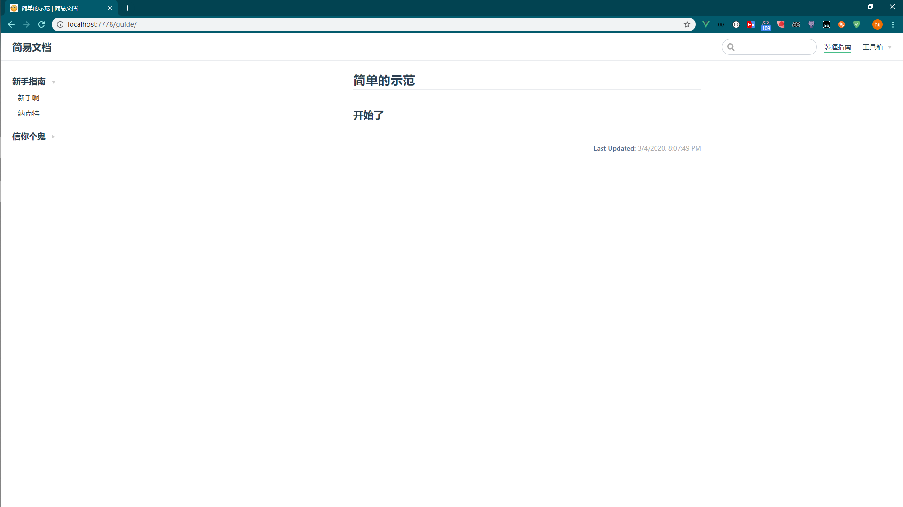

# VuePress-Init
## vuepress
官方文档：https://www.vuepress.cn/

## 简介
VuePress 由两部分组成：第一部分是一个极简静态网站生成器，它包含由 Vue 驱动的主题系统和插件 API，另一个部分是为书写技术文档而优化的默认主题，它的诞生初衷是为了支持 Vue 及其子项目的文档需求。

每一个由 VuePress 生成的页面都带有预渲染好的 HTML，也因此具有非常好的加载性能和搜索引擎优化（SEO）。同时，一旦页面被加载，Vue 将接管这些静态内容，并将其转换成一个完整的单页应用（SPA），其他的页面则会只在用户浏览到的时候才按需加载。

## 作用
初始化完毕，修改配置添加文章即可
##  使用方法

注意：npm install -g vuepress（先全局安装）
``` sh
## 克隆 
1. git clone https://github.com/17623252837/VuePress-Init.git

2. cd VuePress-Init

## 安装依赖
3.npm install -D vuepress

## 运行
4.vuepress dev docs

```
## 访问 http://localhost:7777/

## 截图
### 首页


### 二级页面

